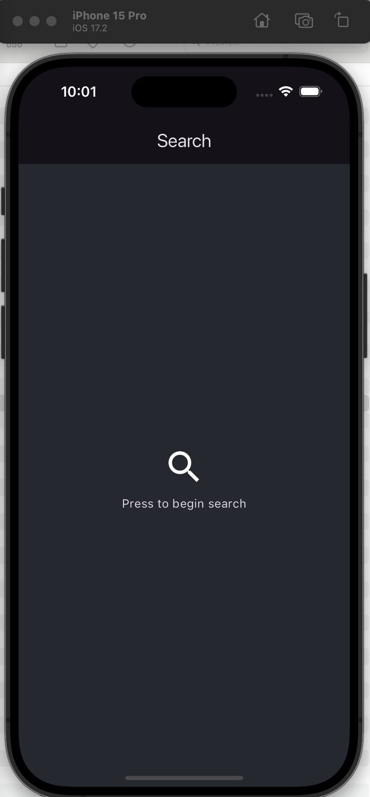

# movie_app

Implement search and viewing of information on the film.
The first screen contains:
- a search string (from 2 characters)
- a list of found films in the form of a table.
Display the poster, title, description of the film in the cell
When clicking on the cell, go to the screen with information about the film:
Display the poster, title, description of the film, rating.
- Cache the found films in the database.
- Create a deeplink with a transition to information on the film (it is enough to work only from the console command)

- Stack
flutter >= 3.16.0
bloc
retrofit/dio
sqflite

API
https://developers.themoviedb.org/3/getting-started/introduction
Movie search
https://api.themoviedb.org/3/search/movie?api_key=YOUR_API_KEY&query=Black%20Adam
Poster download
https://image.tmdb.org/t/p/w500/3MgwChvi42N1RnhQE9A4pQVHyUY.jpg

.env API_KEY=38444b10476064c7e49cba81a72d4aaf

[//]: # (![Project]&#40;./assets/images/main_background.png&#41;)

